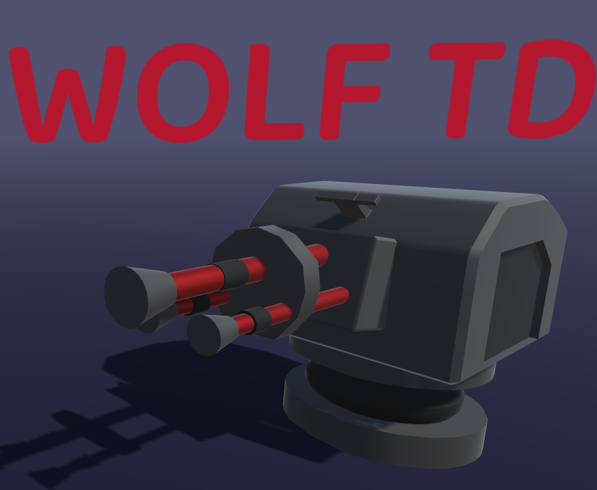

# WolfTD

WolfTD is a simple Tower Defense game created in Unity. As of right now the game is fully functional and features the following. I'd like to add some more to the game, given the time.

* 3 different types of turrets
* Level selection 
* Upgradable turrets and shop system
* Different enemy variants and levels
* Retry functionality for levels

You can try out the game by clicking the link: https://themightywolfe.itch.io/wolftd or by downloading it from the Github releases section to the right of the repo page.

Simply download the ZIP file and launch the file titled WolfTD.exe

WolfTD is my first real project created in Unity, and is also the first experience I have had working with the C# language. Since it was my first time, I utilized the help of both Unity and youtube tutorials to help me create the game. Thank you for taking the time to check it out!
  
################## FOLDER EXPLANATION #########################

My-assets Folder: Contains sprite images that are utilized for shop icons. Special thanks to devassets.com for providing free assets that were used in this game.

WolfTD- Primary folder that contains all needed assets and settings for running the game. Most important subfolder is Assets, which contains the script for GameLogic, animations, prefabs, texture materials, and more.

################# DOCUMENTATION ################################## 

Most of the game is controllable by using the mouse. 

WASD allows player to move the camera up, down, left, and right as needed.

ESCAPE brings up the menu in game.
